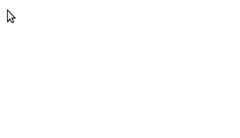

Box Line Text
=============

Box Line Text (BLT) is a simple virtual whiteboarding tool. It is minimalistic and contains no visible UI for a clean screencasting experience.

[Use it](https://box-line-text.netlify.app/)

Usage
-----

- Click anywhere to create a text element
- Click and drag a straight line to make a line
- Click and drag a diagonal line to make a box
- Hold shift to use the mouse as an eraser
- Share documents via URL

Advanced Usage

- Press Ctrl-z to undo creating elements
- Ctrl+Click and drag on an element to move it
- Ctrl+Click and drag on the background to move all elements
- Immediately after creating an element, use the arrow keys to cycle through a few basic styles:
    - Boxes - Background colors
    - Lines - Arrows
    - Floating text - Double size, quad size, vertical

    

This tool assumes that you are screencasting from a laptop or desktop, so it is optimized for using a mouse to create figures and a physical keyboard to create text. It does not provide touch and pen support.

FAQ
---

### How do I save?

Diagram state is stored in the URL, so any method of saving a URL can be used to save your work. In most browsers, you also can save the page as an HTML file. This should save your diagram and allow you to pick up where you left off. Screenshots and/or screen recordings may also be used to save your work.

### Is there a way to make the diagram larger or smaller?

Native zoom in your browser is supported and should work for this purpose.

### Can I make the diagram fill my entire screen?

Yes. Full screen mode is supported. You can enter full screen mode as you normally would in your browser (perhaps by pressing F11).
